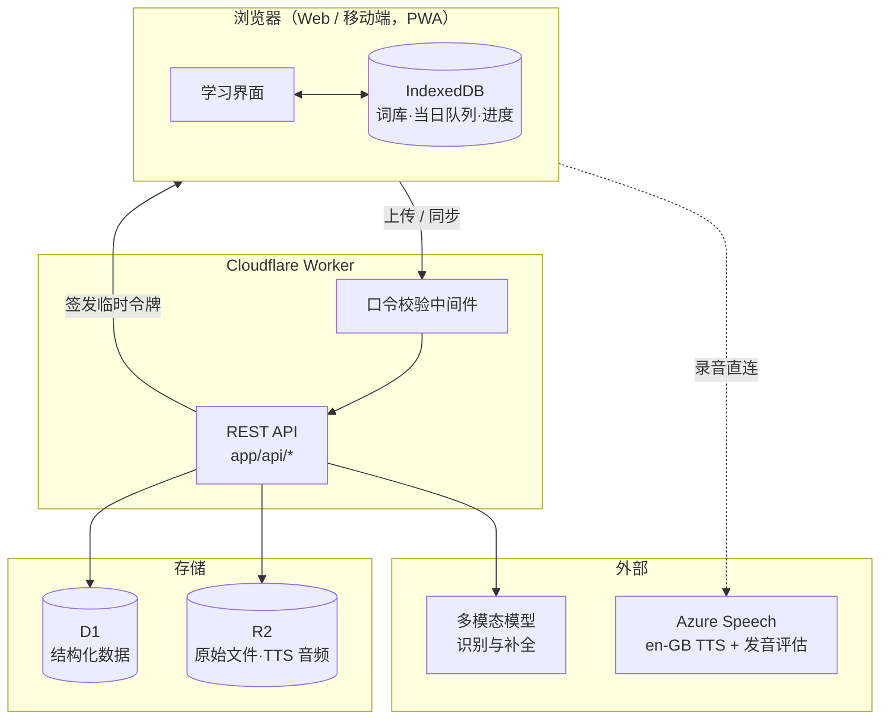
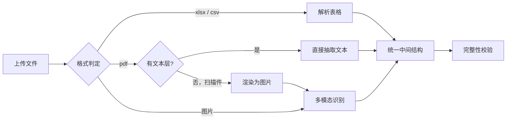
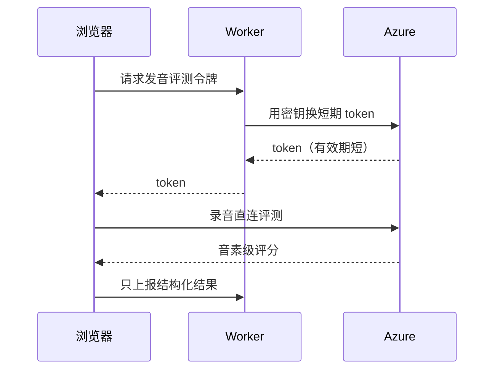

# 技术架构

面向第一步（Web 端）。所有设计以已确定的四项决策为前提，
见 `docs/decisions/`。

## 总览



**要点**：日常背诵全在 IndexedDB 里完成，不经过网络；
录音直连 Azure，不经我们的服务器中转。

---

## 一、导入与识别管线

### 1.1 按格式分流（关键设计）

用户三种格式都会用，但**成本与准确率相差两个数量级**，必须分流，
不能一律走视觉模型：



| 路径 | 处理方式 | AI 成本 | 准确率 |
| --- | --- | --- | --- |
| **Excel / CSV** | 直接解析 | **0** | ~100% |
| **PDF（有文本层）** | 抽取文本层 | **0** | ~99% |
| PDF（扫描件） | 渲染后走视觉 | 高 | 见下 |
| **图片** | 多模态模型 | 高 | 依赖拍摄质量 |

**PDF 必须先探测文本层。** 本项目的 3500 词底库正是这样处理的
（`scripts/parse-gaokao-3500.py`），零 AI 成本、43 页几秒完成。
把有文本层的 PDF 当图片处理是纯粹的浪费。

### 1.2 Excel 路径的实际难点

不是解析，而是**列语义不确定**——哪列是单词、哪列是释义、有没有表头。

方案：读取前 5 行 → 用规则+小模型推断列映射 → **给用户一个确认界面**
（「第 1 列=单词，第 2 列=释义，对吗？」）。确认一次，后续同结构文件自动套用。

### 1.3 图片路径的输出要求

基于 `docs/material-analysis.md` 的版式分析，模型输出必须包含：

```jsonc
{
  "page_items": [
    {
      "seq": 175,                    // 原始序号，用于完整性校验，不可丢弃
      "word": "indicate",
      "pos": ["v"],
      "meaning": "表明",
      "marked": false,               // 是否带手写圈注
      "confidence": 0.98
    }
  ],
  "page_number": 121,
  "detected_layout": "two-column"
}
```

三条硬要求：

1. **保留 `seq`** —— 序号是完整性校验的凭据。竞品在识别阶段就把它剥离扔掉，
   放弃了免费的质量保障。
2. **双栏阅读顺序** —— 先左栏到底，再右栏。prompt 中显式声明。
3. **`marked` 字段** —— 识别手写圈注、下划线、高亮。见 1.5。

### 1.4 完整性校验（确定性，不依赖模型自觉）

材料编号连续、每页固定 58 条，因此可用规则自动验收：

| 故障 | 检测 | 处置 |
| --- | --- | --- |
| 漏识别 | 序号断号 | 标出缺号，提示重拍该区域 |
| 重复 | 序号重复 | 自动去重，保留高 confidence 项 |
| 串栏 | 序号非递增 | 按 seq 重排 |
| 邻页混入 | 序号越出本页区间 | 剔除 |
| 整页不全 | 条数 ≠ 预期 | 告警 |

**这是本方案相对竞品最实在的质量优势**——不是「模型更好」，
而是「有确定性的验收标准」。

> 注：编号连续是本材料的特性。对无编号的材料，此校验降级为
> 「条数统计 + 人工抽查」，不阻断流程。

### 1.5 手写圈注 → 重点词

用户明确：**圈注表示「难背」或「要重点记忆」**。

多模态模型可直接被要求识别圈注/下划线/高亮，输出 `marked: true`，
映射到词条的 `is_key` 字段。

这个字段有三处用途：

1. **筛选** —— 单独练重点词（对应竞品的 `🚩重点词`）
2. **排程加权** —— 重点词初始难度调高，复习更频繁（见第四节）
3. **每日队列优先** —— 同等条件下重点词排在前面

竞品有 `重点词` 字段却**只能手动标**，识别时把满页圈注全丢了。
我们把这条线接上，成本几乎为零。

> Excel 与 PDF 路径无圈注信号，`is_key` 默认 false，可后续手动标记。

### 1.6 异步任务

一次导入约 7 页 / 400 词（见材料分析），**不是零散操作**。

- 上传后立即返回 `job_id`，前端轮询或用 SSE
- 处理在 Worker 中进行，**用户可以关页面**
- 竞品的「请勿退出」前台阻塞在这个量级下体验很差

原始文件存 R2，便于识别出错时重跑而不必让用户重拍。

---

## 二、内容补全管线

### 2.1 为什么必须以 AI 生成为主

`docs/material-analysis.md` 实测：孩子的 400 词与 3500 底库
**仅 49.5% 重合**。因此「底库为主、AI 兜底」不成立，必须反过来。

| 字段 | 来源 |
| --- | --- |
| 单词、词性、中文释义 | **识别结果**（用户材料自带） |
| 音标 | **AI 生成**（en-GB 音标，与发音口音一致） |
| 词组搭配 | **AI 生成** |
| 例句 + 翻译 | **AI 生成**（高考语境） |
| 词根助记 | **AI 生成**，按词供给，无则不显示 |

### 2.2 底库的新角色：交叉校验

命中底库的 198 个词，用底库的词性/释义与识别结果比对：

- 一致 → 置信度提升
- 分歧 → 标记 `needs_review`，优先送人工审核

底库从「数据源」变为「校验参照」。

### 2.3 家长审核界面（必需，非可选）

竞品的做法是挂两层免责声明（页面胶囊 + 每卡小字「内容由 AI 生成,仅供参考」），
**把风险转嫁给用户，却不给修正能力**。

对学习产品这是错的：**错误内容比缺失内容危害更大**——
孩子背错了要花更大代价纠正。

因此：

- 识别结果与生成内容**全部可编辑**
- 低置信度、`needs_review` 的条目**默认排在审核队列前面**
- 审核前的词条可以先学（不阻塞），但在界面上有标记

### 2.4 音标与 TTS 的一致性

音标生成必须是 **en-GB**（决策 002），与 Azure 的英音语音一致。
若音标用美音、TTS 用英音，孩子会困惑。

TTS 音频生成后**缓存到 R2**，同一个词只合成一次。

---

## 三、计划引擎

### 3.1 反向倒算，而不是正向设定

`docs/study-plan-analysis.md` 的实测结论：
**「每天背 N 个词」是有误导性的设定**——N 只是新词，
实际单日负荷 = 新词 + 累积复习。孩子设「每天 50」，第 8 天要面对 250 条。

因此计划引擎的输入是：

```
总词数 + 目标完成日期  →  倒算每日新词量
```

而不是让用户填每日新词量。

### 3.2 约束条件

设最长复习间隔为 `L`（基线 15 天），目标周期 `D` 天，总词数 `N`：

```
每日新词量 ≥ N / (D - L)
```

本目标（400 词 / 30 天，L=15）：`400 / 15 ≈ 27`。
低于 27，月底必然有复习溢出。**建议取 27–34**，上限留缓冲。

### 3.3 必须展示负荷曲线

设定完成后展示未来 30 天的每日总量预测：

```
第 1 天   20 新 +   0 复习 =  20  ████
第 8 天   20 新 +  80 复习 = 100  ████████████████████
```

让孩子提前知道「第 8 天起会变重」。
**建立预期比事后解释有效得多**——这是放弃率最高的时点。

### 3.4 落后补救

孩子请假两天后，堆积的复习不能简单顺延（会雪崩）。策略：

| 策略 | 说明 |
| --- | --- |
| **优先级截断**（默认） | 按「距遗忘临界的远近」排序，当日只做最紧急的 N 个，其余顺延 |
| 延长周期 | 自动把目标日期后推 |
| 提示调整 | 落后超过阈值时，建议用户改目标 |

默认用优先级截断，保证「每天的量是可完成的」，这比「保证计划不变」更重要。

---

## 四、复习算法

### 4.1 选型：SM-2 变体，不用 FSRS

| 方案 | 评价 |
| --- | --- |
| 固定间隔（艾宾浩斯） | 竞品做法，简单但不适应个体差异 |
| **SM-2 变体**（推荐） | 成熟、可解释、无需训练数据 |
| FSRS | 更准，但需要大量历史数据训练，单用户场景发挥不出优势 |

单个孩子、400 词的规模，SM-2 足够，且**可解释性**很重要——
竞品的 `复习逻辑 ⓘ` 把算法讲给用户看，这个取向值得学。

### 4.2 用户可见的抽象：掌握度四级

底层是 `ease_factor` + `interval`，但**呈现给用户的是四级**
（沿用竞品，孩子和家长都易懂）：

| 级别 | 颜色 | 含义 |
| --- | --- | --- |
| 生词 | 红 | 未掌握 |
| 半熟 | 橙 | 见过但不稳 |
| 熟悉 | 绿 | 基本掌握 |
| 永久掌握 | 黑 | 移出常规复习 |

### 4.3 手动改判是必需的逃生阀

竞品的左滑改级 + 右滑删除是成熟设计，必须有。
算法判错时用户能一票否决，否则只能忍受。

- **左滑**：改四级掌握度 → 重置底层 `ease`/`interval`
- **右滑**：删除（彻底移出复习）/ 收藏 / 标记重点词

### 4.4 重点词加权

`is_key = true`（来自手写圈注）的词：初始 `ease_factor` 调低，
复习更频繁，且同等条件下在每日队列中排前。

---

## 五、发音评测

### 5.1 两件事分开

| 能力 | 实现 |
| --- | --- |
| TTS（读给孩子听） | Azure en-GB 神经语音，结果缓存 R2 |
| **发音评测（判断读得对不对）** | Azure Pronunciation Assessment，**音素级** |

必须做到音素级，否则只能说「你读错了」，说不出「错在哪个音」，
对纠正没有实际帮助。

### 5.2 调用方式：临时令牌



**密钥不出服务端，音频不经我们的服务器。**
延迟低，实时反馈，且天然满足下一条。

### 5.3 录音数据处理

评测对象是未成年人语音，按最小化处理：

- **录音用完即弃**，不长期留存原始音频
- 只存结构化结果（分数、错音音素）
- 若要做「跟读回放对比」，音频留在浏览器 IndexedDB，不上传

---

## 六、数据模型（D1）

```
users            单用户仍带 id，为第二步小程序的微信登录预留
wordbooks        一次导入 = 一本词书（如「斯淇英语核心词 400」）
words            词条：seq / word / pos / meaning / is_key / needs_review
word_details     音标 / 词组 / 例句 / 翻译 / 词根助记（AI 生成，可编辑）
study_states     每词的掌握度、ease、interval、due_at
study_logs       答题记录，用于算法调参与战报
plans            目标词数、截止日期、每日新词量、负荷预测
import_jobs      异步任务状态、原始文件 R2 键
pron_scores      发音评测结果（不含音频）
```

`words` 与 `word_details` 分表的原因：
**识别结果与 AI 生成内容的可信度不同、修订频率不同**，
分开便于「重新生成补全内容而不动识别结果」。

Drizzle ORM 已在依赖中（D1 即 SQLite），schema 可移植，
降低第二步迁移成本。

---

## 七、API 设计

**约束（决策 001）：所有业务逻辑放 `app/api/*` 的 Route Handler，
JSON 进出，禁用 Server Actions。** 页面只调 API 和渲染。

这样第二步做小程序时只需重写 UI，后端完全复用。

```
POST   /api/import              上传文件，返回 job_id
GET    /api/import/:id          任务状态与识别结果
PATCH  /api/words/:id           修正识别或生成内容
POST   /api/wordbooks           创建词书
GET    /api/wordbooks/:id/words 拉取词条（供本地缓存）
POST   /api/plans               创建计划（总量+截止日→倒算）
GET    /api/plans/current       当前计划与负荷曲线
GET    /api/study/today         今日队列（新词+到期复习）
POST   /api/study/answer        提交作答，更新掌握度
POST   /api/study/override      手动改判掌握度
POST   /api/speech/token        签发 Azure 临时令牌
POST   /api/speech/score        上报评测结果（不含音频）
GET    /api/tts/:wordId         TTS 音频（R2 缓存）
```

---

## 八、本地优先

背单词的绝大部分交互**不需要联网**：词库、当日队列、答题判分
全在浏览器完成。

| 时机 | 是否联网 |
| --- | --- |
| 背诵、答题、判分、切词 | **否**，IndexedDB |
| 上传识别 | 是（低频，慢无所谓） |
| 发音评测 | 是（直连 Azure，不过我们服务器） |
| 进度同步 | 是（后台静默，失败可重试） |

**这使得 Cloudflare 在大陆的延迟基本不影响日常体验**——
这是比「把服务器搬到境内」便宜得多的解法，也是做成 PWA 的直接理由。

---

## 九、访问控制

产品部署在公网域名 `word.beadfable.com`。虽然只给自家孩子用，
仍必须拦人——否则上传识别与发音评测接口会被滥用产生费用（决策 003）。

**共享口令 + Cookie**，中间件校验，有效期 90 天。
几十行代码，够用。

---

## 十、成本

单用户量级，各项都很小：

| 项 | 说明 |
| --- | --- |
| Cloudflare Workers / D1 / R2 | 免费额度内 |
| 识别 | 一次性，7 页图片 |
| 内容补全 | 一次性，400 词批量生成 |
| TTS | 每词一次，缓存后不再产生 |
| 发音评测 | 每天几分钟音频 |

真正的变量是识别与补全，而它们是**一次性**的。
接入前需到各服务商官网核实单价，此处不写死。

---

## 十一、实施顺序

| 阶段 | 内容 | 验收标准 |
| --- | --- | --- |
| **M1** | Excel/PDF 导入 + 数据模型 + 基础背诵流 | 能把 400 词导进去并背 |
| **M2** | 图片识别 + 序号校验 + 圈注识别 + 家长审核 | 拍 7 页照片能正确导入 |
| **M3** | 计划引擎 + 复习算法 + 掌握度四级 | 能倒算并执行 30 天计划 |
| **M4** | AI 内容补全（音标/例句/词组） | 400 词补全并可编辑 |
| **M5** | 发音评测 + TTS | 跟读能拿到音素级反馈 |
| **M6** | PWA + 本地优先 + 离线 | 断网可背诵 |

**M1 先做 Excel/PDF 而非图片**：这两条路径零 AI 成本、准确率高，
能最快跑通端到端流程，验证数据模型与学习流是否成立。
图片识别是最难的一环，放在流程验证之后做，风险更低。
