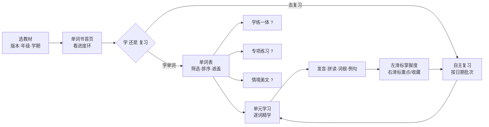
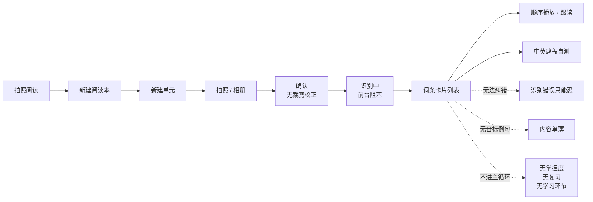

# 超级单词表：功能清单与用户体验地图

基于五批共 22 张截图整理。**全部结论只来自截图可见内容**，未观察到的功能明确标注，
不做形态推断。

标记约定：

- ✅ 截图直接可见
- 🔸 由可见线索推断，置信度标注在说明里
- ❓ 存在入口但内部形态完全未观察到

---

## 一、功能清单

### 1. 全局导航

| 模块 | 状态 | 说明 |
| --- | --- | --- |
| 基础手册 | ❓ | 底部 Tab 1，内容未观察 |
| **单词书** | ✅ | 底部 Tab 2，产品主干 |
| 计划 | ❓ | 底部 Tab 3，**内容未观察，与本项目需求最相关** |
| 我的 | ❓ | 底部 Tab 4，内容未观察 |

### 2. 单词书首页

| 功能 | 状态 | 细节 |
| --- | --- | --- |
| 搜索单词 | ✅ | 顶部搜索框 |
| 切换教材 | ✅ | 教材精确到 版本 + 年级 + 学期 + 课标（如「北京版三年级下（新课标版）」） |
| 学习进度环 | ✅ | 已学 / 未学 / 总词数三分（示例 48 / 102 / 150） |
| 学习记录 | ❓ | 有入口，内部未观察 |
| 打卡天数 | ✅ | 独立于学习进度的连续激励指标 |
| 学单词 | ✅ | 主入口（实心按钮） |
| 去复习 | ✅ | 次入口（描边按钮） |
| 统计式学习 · 自然拼读 | ✅ | 落地为单元学习页内的字母→音映射视图 |
| 统计式学习 · 词根词缀 | ✅ | 落地为单元学习页内的词根助记卡 |
| 统计式学习 · 音标组 | 🔸 | 推断为按音素聚类，落地形态未单独观察 |
| 收藏本 | ✅ | 支持建多个（示例：`单词本` / `Unit1`） |
| 错题本 | ❓ | 有入口，形态与进入条件未观察 |
| 标签本 | ✅ | 落地为单词表的 `🔖标签` 筛选 |
| 拍照阅读 | ✅ | 见第 6 节 |

### 3. 单词表页

| 功能 | 状态 | 细节 |
| --- | --- | --- |
| 单元切换 | ✅ | `Lesson 9 ⌄` |
| 科学刷词 | ❓ | 标题栏独立入口，**内部算法与形态完全未观察** |
| 遮盖模式 | ✅ | `无遮盖 ⌄` 下拉，至少含「无遮盖」及若干遮盖态 |
| 重点词筛选 | ✅ | 红旗 chip |
| 学习状态筛选 | ✅ | 全部 / 已学 / 未学 |
| 标签筛选 | ✅ | 用户自定义标签 |
| 排序 | ✅ | `正序 ▽` |
| 词条卡片 | ✅ | 词形 + 音标 + 词性 + 释义 + 掌握度色条 + 学习次数 |
| 「上次学习」角标 | ✅ | 绿色角标标记续学断点 |
| 左滑：掌握度四级 | ✅ | 生词(红) / 半熟(橙) / 熟悉(绿) / 永久掌握(黑) |
| 右滑：三操作 | ✅ | 删除 / 收藏 / 重点词 |

底部四入口：`专项练习` ❓ / `单元学习` ✅ / `学练一体` ❓ / `情境美文` ❓

### 4. 单元学习页（逐词学习）

| 功能 | 状态 | 细节 |
| --- | --- | --- |
| 词条 Tab 横排跳转 | ✅ | spring / summer / autumn / winter / season |
| 四线三格书写背景 | ✅ | 音节分色显示（`win·ter` 深蓝 + 橙） |
| 音标 + 发音 | ✅ | `/ˈsʌmər/ 🔊` |
| **单词录音** | ✅ | 音标旁独立麦克风，**无评分界面** |
| 完整翻译 | ✅ | 可切换，设置项里有总开关 |
| 拆分发音视图 | ✅ | 可点击音素块 + 口型示范视频 ▶️ + 音素详解 🔍 |
| 自然拼读视图 | ✅ | 字母→音映射，同色标注对应关系 |
| 词根助记卡 | ✅ | `spr 散开 + ing = spring 春天`，附白话解释；**按词供给** |
| 实用口语卡 | ✅ | 例句单词染色 + 中译 + 四操作 + 多条翻页（3～5 条不等） |
| 例句四操作 | ✅ | 播放 / 慢速 / **录音** / **AI** ❓ |
| 收藏 | ✅ | ☆ 图标，弹窗选择目标收藏本 |
| 打标签 | ✅ | 🏷 图标 |
| 加强学习 | ❓ | 底部主按钮，行为未观察 |
| 机器人图标 | ❓ | 疑似 AI 助手入口，行为未观察 |

### 5. 复习模块

| 功能 | 状态 | 细节 |
| --- | --- | --- |
| 自主复习 | ✅ | 用户主导的复习模式 |
| 模式切换 | ❓ | `模式 ⇅`，可选模式未观察 |
| 复习逻辑说明 | 🔸 | `复习逻辑 ⓘ` 入口可见，内容未观察；**算法对用户透明**这一取向明确 |
| 日期批次分组 | ✅ | `今天 / 07-22 / 06-22 / 08-02`，非时间顺序，可任选批次 |
| 筛选与遮盖 | ✅ | 与单词表同一套 |
| 科学刷词 | ❓ | 与自主复习并列的另一模式，**内部完全未观察** |

### 6. 拍照阅读模块

| 功能 | 状态 | 细节 |
| --- | --- | --- |
| 阅读本管理 | ✅ | 多本，可增删；空状态无任何引导 |
| 单元管理 | ✅ | 阅读本下分 Unit，Tab 横排 |
| 拍照导入 | ✅ | 仅 `拍照` / `从手机相册选择`，**无 Excel / PDF / 文件** |
| 应用内相机 | ✅ | 闪光灯、设置、W/1x/2x/3.5x/10x 变焦 |
| 拍摄确认 | ✅ | 仅 ✓ / ✗，**无裁剪、无透视校正、无旋转** |
| 识别处理 | ✅ | 带百分比进度，**前台阻塞（「请勿退出」）** |
| 识别质量 | ✅ | 双栏顺序正确、序号剥离、抗屏摄摩尔纹，**质量高** |
| 结果卡片 | ✅ | 原文行 + AI 解析释义 + 「内容由 AI 生成,仅供参考」 |
| 标注模式 | ✅ | `语法 / 词性 / 无` 三段切换 |
| 遮盖自测 | ✅ | `EN中` → `中`，英文变灰块 |
| 顺序播放器 | ✅ | 倍速、上/下一条、播放暂停、当前项高亮 |
| 当前项录音 | ✅ | 麦克风仅出现在高亮卡片，**无评分** |
| 免责声明 | ✅ | 常驻胶囊 + 每卡小字，双重免责 |
| **编辑纠错** | ❌ | **五批中未见任何编辑入口** |
| **音标 / 例句 / 词组** | ❌ | **全部缺失** |
| **进入学习循环** | ❌ | 无掌握度、无筛选、无学习环节 |

### 7. 设置

| 设置 | 取值 |
| --- | --- |
| 自动发音 | 开 / 关 |
| 发音人 | 美音 Alysa（真人）/ 美音 安娜 / 英音 Scott（真人）/ 英音 瑞恩 |
| 音标模块 | 开 / 关 |
| 完整翻译 | 开 / 关 |
| 语音方式 | 拆分 / 慢速 / 标准 |
| 口语慢速 | 拆分 / 慢速 |
| 翻译字号 | 七档滑杆 |
| 模块字号 | 七档滑杆 |

---

## 二、用户体验地图

### 2.1 主链路（内置教材词库）

### 2.2 拍照导入链路（断裂链路）

### 2.3 分阶段体验拆解

| 阶段 | 用户目标 | 竞品触点 | 做得好的 | 断点 |
| --- | --- | --- | --- | --- |
| **建库** | 让 App 拿到我要背的词 | 切换教材 / 拍照导入 | 教材颗粒度细；OCR 质量高 | 只支持图片；无法纠错；导入词残缺 |
| **定计划** | 定每天背多少 | 「计划」Tab ❓ | — | **未观察，无法评价** |
| **学** | 记住词形音义 | 单元学习 / 学练一体 / 专项练习 | 发音教学极深；词根助记有效 | 深度偏向低龄解码；高阶学习者过剩 |
| **练** | 检验是否真会 | 遮盖自测 / 专项练习 ❓ | 遮盖开关一键切换学与测 | 拍照词库只有遮盖，无题型 |
| **复习** | 到期重现 | 自主复习 / 科学刷词 ❓ | 批次可自选；算法对用户透明 | 拍照词库完全不参与 |
| **反馈** | 知道自己进展 | 进度环 / 打卡 / 学习次数 / 掌握度色条 | 多维度且轻量 | 拍照词库无任何进度反馈 |
| **纠偏** | 修正算法误判 | 左滑四级 + 右滑删除 | **双重逃生阀，设计成熟** | 拍照词库不可用 |

### 2.4 三个体验断点（按严重度）

**① 拍照导入的词是「二等公民」——最严重**

用户拍进去的是**自己最需要背的词**（老师划的重点、讲义、错题），
却只能听和遮盖自测，无法进入掌握度、复习、题型任何一环。
用户为了背这些词，还得手动去内置词库里找一遍——如果找得到的话。

**② 识别结果不可编辑**

OCR 质量再高也有错。竞品的应对是两层免责声明（页面胶囊 + 每卡小字），
把风险转给用户，而不是给用户修正的能力。对学习类产品，
**错误内容比没有内容更有害**——孩子背错了要花更大代价纠正。

**③ 「重点词」字段与手写圈注之间的断线**

产品有 `🚩重点词` 手动标记，也有筛选。但拍照识别时，
原稿上老师／孩子已经圈出来的重点被完全忽略。
**最有价值的优先级信息，在最该被采集的一刻被丢掉了。**

---

## 三、对本项目的结论

### 3.1 直接采纳

1. 掌握度四级 + 左滑改判 + 右滑（删除 / 收藏 / 重点词）
2. 遮盖开关（一个开关在「学」与「测」之间切换）
3. 学习状态筛选（全部 / 已学 / 未学）+ 自定义标签
4. 「上次学习」角标续学
5. 词根助记卡（取实用主义，按词供给，不硬凑）
6. 复习逻辑对用户透明
7. 字号可调（无障碍，成本极低）

### 3.2 明确不做

1. **自然拼读、音素口型视频、四线三格书写**——面向小学解码训练，
   高考场景无效，投入产出极低
2. **真人录音库**——成本结构决定了用户上传词无法覆盖，全量 TTS 是唯一可行路线
3. **教材版本体系**——我们的词从用户上传来，不需要教材树

### 3.3 差异化重点

| # | 机会 | 依据 |
| --- | --- | --- |
| 1 | **导入词与内置词共用同一套学习内核** | 竞品维护两套导致拍照词库残缺；我们只做一套，既是产品优势也更省工程 |
| 2 | **支持图片 / Excel / PDF 三种入口** | 竞品只有图片 |
| 3 | **识别结果可编辑**（家长审核） | 竞品用免责声明替代纠错能力 |
| 4 | **识别手写圈注为重点词** | 竞品有字段却没接数据源；多模态模型实现成本极低 |
| 5 | **AI 发音评分** | 五批未见任何评分界面，判断为竞品空白区 |
| 6 | **服务端异步识别** | 竞品前台阻塞，多页导入体验差 |
| 7 | **词根词缀聚类用于高考 3500 词** | 竞品的对应功能面向低龄，价值错配 |

### 3.4 尚需补充观察

以下功能五批均未出现，**若能补充截图，将直接影响 PRD 的对应章节**：

| 缺失项 | 影响的 PRD 章节 | 重要性 |
| --- | --- | --- |
| **「计划」Tab** | 每日词量自定义、学习计划生成 | **最高** |
| 科学刷词 | 间隔重复算法设计 | 高 |
| 学练一体 / 专项练习 | 题型设计 | 高 |
| 错题本 | 错词处理流 | 中 |
| 加强学习 | 强化机制 | 中 |
| 情境美文 / AI 按钮 | 附加内容形态 | 低 |
